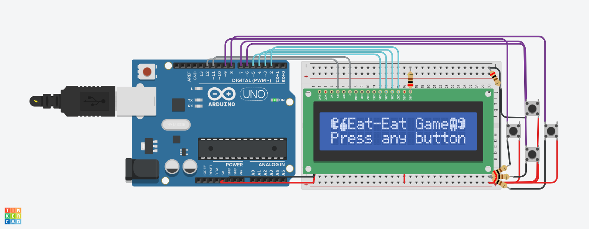

# EAT-EAT GAME🎮



## Gameplay Description👻 

In Eat-Eat, players control a character with the goal of consuming as many fruits as possible while avoiding ghosts. The game runs on a 16x2 LCD display, and the character's movement is controlled via four buttons: up, down, left, and right. Upon powering the system, the initial screen is displayed, prompting the player to press any button to start the game.

During gameplay, fruits and ghosts move automatically across the screen. Players must navigate their character to collect fruits, earning points for each successful collection. If the character occupies the same position as a ghost, the game ends, and a game-over screen is displayed showing the player's score. After a brief pause, the game resets to the initial screen, allowing for another attempt.

## Technical Implementation🔧

The Eat-Eat game was developed using the  PlatformIO IDE in Visual Studio Code, leveraging the Arduino framework for simplicity and versatility in microcontroller-based projects. The 16x2 LCD display is controlled using the LiquidCrystal library, ensuring efficient rendering of game elements. Additionally, the electrical circuit was simulated on Tinkercad, allowing for precise prototyping and testing without requiring physical components.

The game's code is organized into multiple files to improve maintainability and readability. Custom sprites for the game elements (the player, fruits, and ghosts) are defined in a separate header (sprites.h) and implementation file (sprites.cpp), ensuring modularity. The main game logic is implemented in main.cpp, which handles button inputs, character movement, collision detection, and game state transitions. Randomization of fruit and ghost positions is achieved through seeding with analog readings and time functions, ensuring unpredictable gameplay. The entire system utilizes a straightforward state machine approach to transition between the initial screen, active gameplay, and game over states.

## [SCHEMATIC VIEW HERE!](assets/schematic.pdf)

## Components🔌

- ( 1 ) Arduino Uno R3
- ( 1 ) Breadboard
- ( 1 ) LCD 16x2
- ( 4 ) Buttons
- ( 5 ) 200Ω Resistor

> Project Status: concluded

### Git🤖

To manage version control and clone repositories, you'll need Git. Here's a quick installation guide:

1. **Download**: Visit the [Git website](https://git-scm.com/) and download the appropriate installer for your operating system.
2. **Install**: Run the installer and follow the setup instructions. You can choose the default options for most settings.
3. **Verify**: Open a terminal or command prompt and type `git --version` to ensure Git is installed correctly.

## Cloning the Repository🧬

To clone this repository to your local machine, follow these steps:

1. **Open Terminal**: Open a terminal or command prompt on your machine.
2. **Clone Repository**: Use the following command to clone the repository:

```bash
  git clone https://github.com/HenriqueMelo2007/eat-eat-game.git
```

## Contacts

📧 henriquemelo0983@gmail.com

💼 LinkedIn: [Henrique Melo](https://www.linkedin.com/in/henrique-de-oliveira-melo-933a41203/)